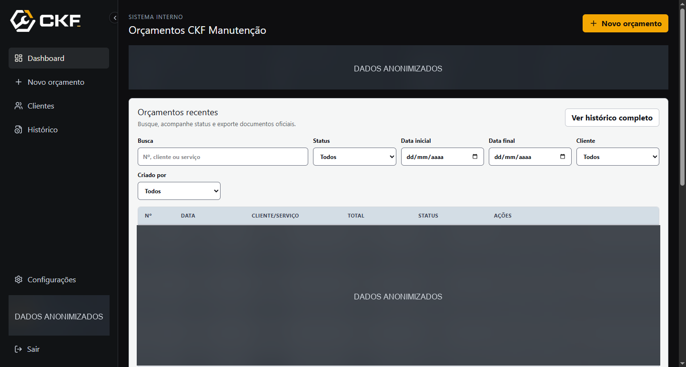
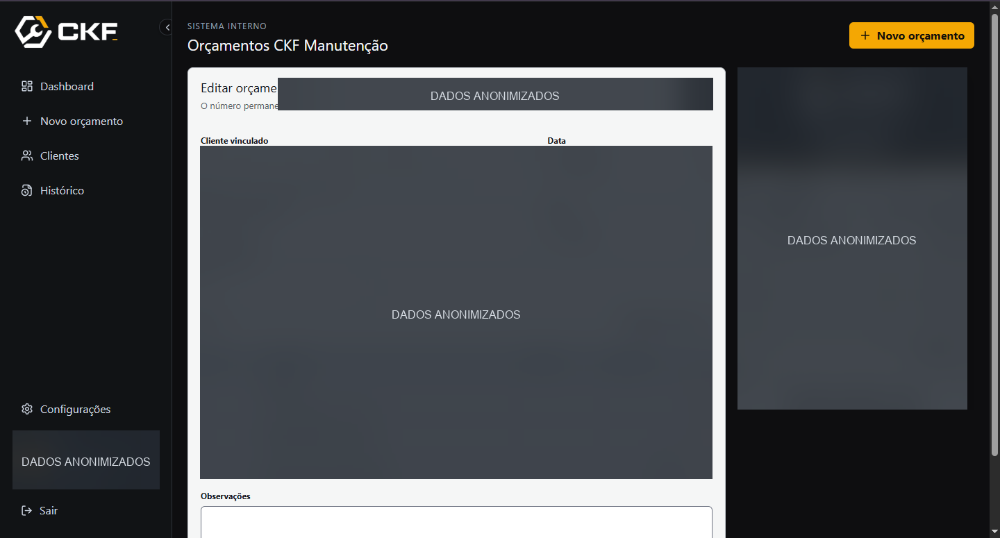
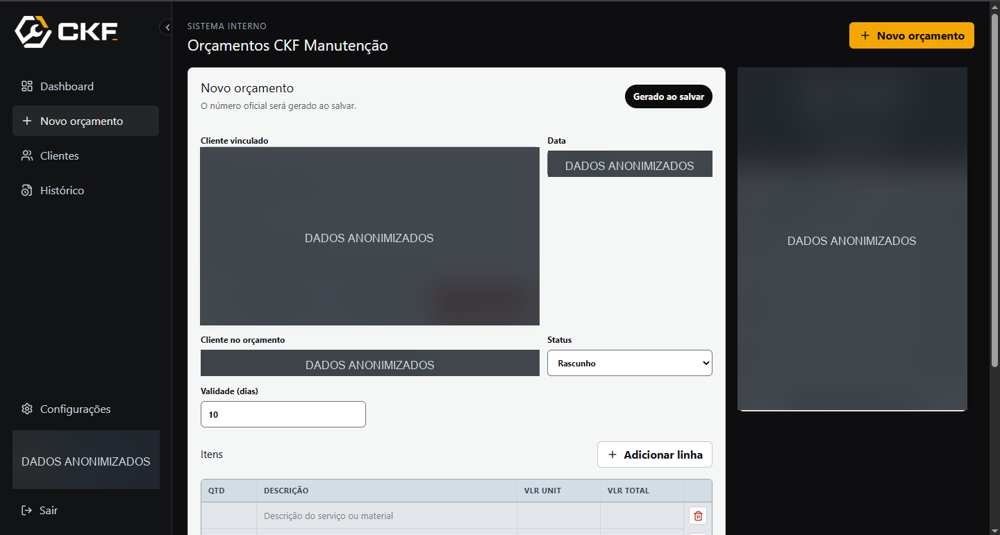
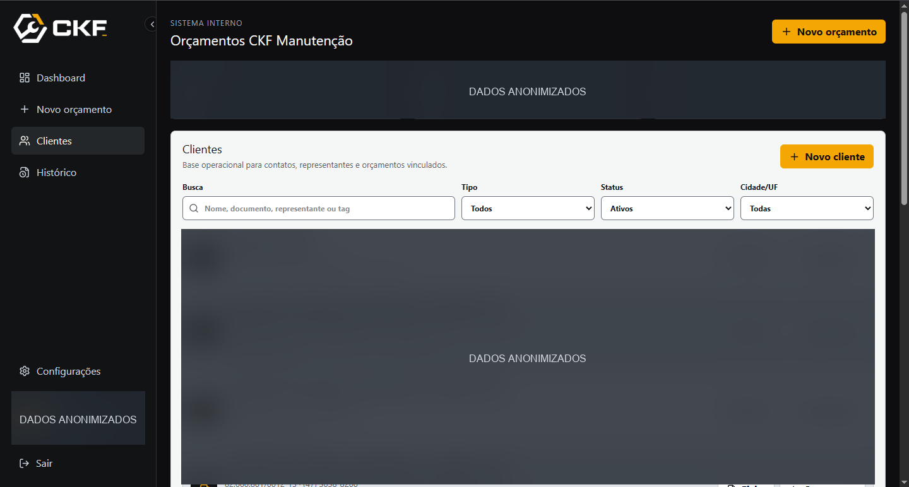
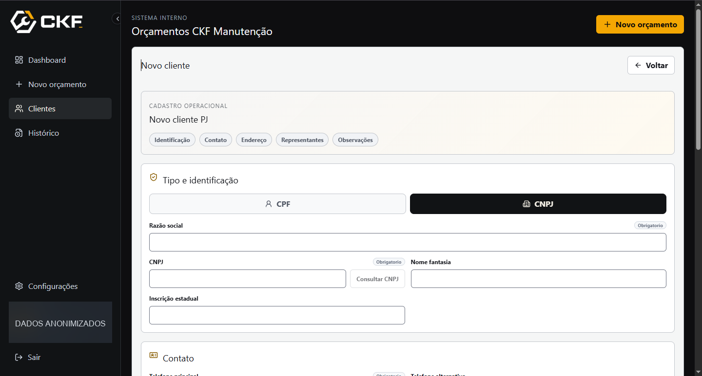
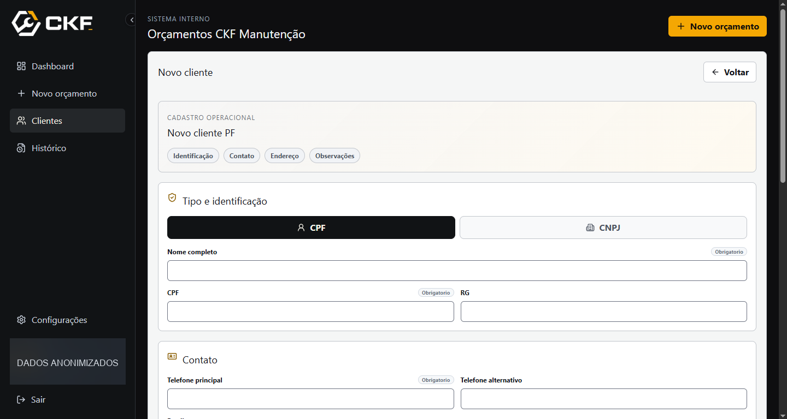

# CKF Manutenção — Sistema de Orçamentos

<p align="center">
  Sistema interno para criar, consultar e emitir orçamentos da CKF Manutenção.
</p>

<p align="center">
  <a href="https://github.com/Kauerc10/ckf-manutencao-orcamentos/actions/workflows/ci.yml"></a>
  <a href="https://github.com/Kauerc10/ckf-manutencao-orcamentos/actions/workflows/security.yml"></a>
  
  
  
  
</p>

## O que já está no sistema

- Login e controle de acesso integrados ao Supabase.
- Cadastro, busca, edição e detalhamento de clientes e representantes.
- Criação, edição, consulta, duplicação, filtragem e exclusão de orçamentos.
- Identificação de cliente cadastrada ou preenchida manualmente, preservada no documento como snapshot.
- Geração de PDF comercial e exportação de histórico em CSV e XLSX.
- Status, histórico operacional, configurações institucionais e layout administrativo responsivo.
- Exclusão protegida por Edge Function, aprovação administrativa e trilha de auditoria.

## Ecossistema CKF

| Repositório | Responsabilidade |
| --- | --- |
| [CKF Design](https://github.com/Kauerc10/ckf-design) | Marca, assets e entregas visuais aprovadas |
| [Site Institucional](https://github.com/Kauerc10/ckf-site-institucional) | Presença pública e captação de contatos |
| **[Sistema de Orçamentos](https://github.com/Kauerc10/ckf-manutencao-orcamentos)** | Operação interna, clientes, orçamentos e documentos comerciais |

Os assets visuais devem ser originados no repositório de design e aplicados aqui por pull request.

## Stack

React 19, TypeScript 6, Vite 8, Tailwind CSS 4, Supabase, Vitest, React PDF e ExcelJS.

## Executar localmente

Requer Node.js 24.

```bash
git clone https://github.com/Kauerc10/ckf-manutencao-orcamentos.git
cd ckf-manutencao-orcamentos
npm ci
Copy-Item .env.example .env.local
npm run dev
```

Em macOS ou Linux, use `cp .env.example .env.local` no lugar de `Copy-Item`.

Preencha apenas as variáveis públicas do Supabase em `.env.local`:

```env
VITE_SUPABASE_URL=https://seu-projeto.supabase.co
VITE_SUPABASE_PUBLISHABLE_KEY=sb_publishable_sua_chave
```

Nunca versione chaves secretas, service role keys ou arquivos `.env`.

## Qualidade e automação

```bash
npm run lint
npm test
npm run build
```

O CI executa lint, testes e build em cada pull request e alteração na `main`. O workflow de segurança procura segredos versionados. O Dependabot propõe atualizações mensais, agrupando dependências de produção e desenvolvimento.

## Estrutura

```text
src/pages/        Telas de login, clientes, orçamentos e configurações
src/components/   Formulários, listagens, diálogos, layout e prévia de documentos
src/data/         Repositórios de dados e configurações
src/lib/          Regras, validações, exportações e integração Supabase
src/stores/       Estado de autenticação e configurações
supabase/         Migrações e Edge Function de exclusão protegida
```

## Banco, autorização e documentos

As migrações em [supabase/migrations](supabase/migrations) versionam schema, permissões, auditoria e regras de acesso. A segurança não depende de esconder ações na interface: RLS, RPCs e a Edge Function validam o acesso no Supabase.

O fluxo de exclusão exige a Edge Function `admin-delete-orcamento`, pois é no
servidor que a senha do administrador é confirmada e as tentativas negadas ou
malsucedidas são auditadas. No primeiro deploy, ou após alterar essa função,
publique o backend antes do frontend:

```bash
npx supabase link --project-ref <PROJECT_REF>
npx supabase db push
npx supabase functions deploy admin-delete-orcamento
```

Os PDFs e planilhas reproduzem os dados do orçamento. A identidade do cliente usada no momento da emissão é preservada para manter a consistência do documento, mesmo quando não houver um cliente cadastrado vinculado.

## Screenshots

As capturas abaixo mostram fluxos reais do sistema. Dados pessoais, contatos, documentos, valores e registros comerciais foram anonimizados antes de serem versionados.

| Dashboard e acompanhamento | Edição com prévia do documento |
| --- | --- |
|  |  |

| Novo orçamento com cliente vinculado | Base de clientes |
| --- | --- |
|  |  |

| Cadastro de pessoa jurídica | Cadastro de pessoa física |
| --- | --- |
|  |  |

## Documentação

- [Guia técnico](docs/REPOSITORY_GUIDE.md)
- [Como contribuir](CONTRIBUTING.md)
- [Segurança](SECURITY.md)
- [Suporte](SUPPORT.md)
- [Licença](LICENSE.md)
